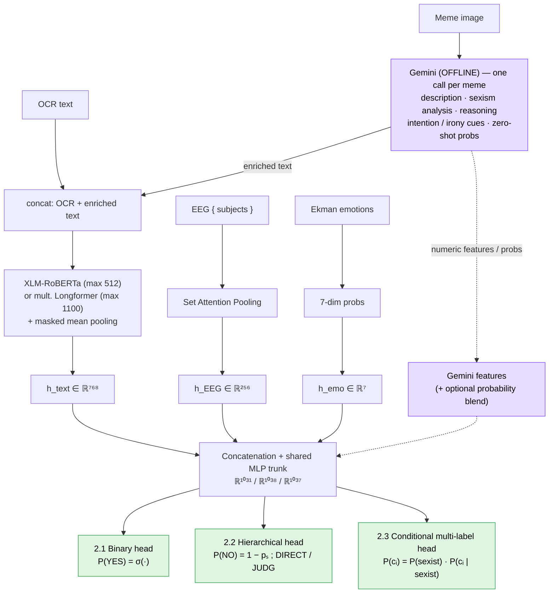

# GEMF — Gemini-Enriched Multimodal Fusion for Sexism in Memes

**Ordantis submission to [EXIST 2026](http://nlp.uned.es/exist2026/) — Task 2 (Sexism Characterization in Memes).**

[](LICENSE)
[](https://www.python.org/)
[](paper/paper_562.pdf)
[](results/RESULTS.md)

> ## 🥇 Best-ranked system at EXIST 2026 Task 2
> Ordantis obtained **three first places** on the official leaderboards, each ranked **#1 across all
> instances, Spanish and English simultaneously**:
> - **Task 2.1 — Binary sexism detection (soft):** 1st of 144
> - **Task 2.2 — Source-intention classification (soft):** 1st of 117
> - **Task 2.2 — Source-intention classification (hard):** 1st of 186
>
> Full leaderboard positions in [`results/RESULTS.md`](results/RESULTS.md).

This repository contains the full pipeline behind the Ordantis runs for EXIST 2026 Task 2:
binary sexism detection (2.1), source-intention classification (2.2) and multi-label sexism
categorization (2.3), over **bilingual (EN/ES) memes enriched with physiological data**.

The core idea is to use **Gemini as a semantic mediator** rather than a black-box classifier:
Gemini interprets each meme offline and turns it into structured text (description, sexism
analysis, reasoning, intention/irony cues and zero-shot probabilities). That text is concatenated
with the OCR, encoded with **XLM-RoBERTa** or a **multilingual Longformer**, and fused with **EEG**
and **Ekman emotion** features before a probabilistic decision. Training uses **soft (annotator-
distribution) targets** rather than majority labels (Learning with Disagreement).

> 📄 Full write-up: [`paper/paper_562.pdf`](paper/paper_562.pdf) ·
> Detailed technical report (Spanish): [`docs/informe_es.md`](docs/informe_es.md)

---

## About the paper

**"Gemini-Enriched Probabilistic Modeling for Multimodal Sexism Characterization in Memes"**
(Sergio Ortiz Montesinos, Fernando Martínez Gómez — UPV / Ordantis; CLEF 2026 Working Notes) —
[`paper/paper_562.pdf`](paper/paper_562.pdf).

The paper describes the system, the design decisions and the official analysis. Its main points:

- **LLM as a semantic mediator, not a classifier.** The central contribution is to use Gemini flash
  3.1 to translate each meme's visual and pragmatic content into structured text (description,
  sexism analysis, reasoning, intention/irony cues, category hints and zero-shot probabilities),
  which supervised multilingual encoders then exploit. This is what lifted Task 2.1 validation AUC
  from **0.741 (raw ViT) to 0.880**, the largest single gain in the pipeline (§6, Table 2).
- **Learning with disagreement.** Rather than majority labels, models train on the empirical
  distribution of the six annotators per meme, which matches the soft evaluation and yields
  well-calibrated probabilities (§3). A mixed-effects analysis (§4) shows annotator demographics
  (age, gender, ethnicity, country) are significantly associated with sexism perception, justifying
  soft labels.
- **Gemini in three roles** — enriched text, auxiliary numeric features, and a fixed probability
  blend (`0.6·model + 0.4·Gemini` for Task 2.1). The blend was decisive: it produced the #1 soft run
  in Task 2.1 and the #1 hard run in Task 2.2 (§5.2, §11).
- **Task-specific heads** matching the label semantics: hierarchical for intention (2.2), conditional
  multi-label for categories (2.3) (§9).
- **Honest failure analysis.** Task 2.3 hard is diagnosed in depth (§14): the same probabilities rank
  10/118 soft but 132/187 hard, isolating the problem to validation-overfit category thresholds and
  unmodeled label co-occurrence (STEREOTYPING-DOMINANCE as a hub category), not the model.
- **Calibration** (ECE/MCE/Brier), **modality ablation** (removing EEG+Ekman costs ~2–3 pts), and
  **cost** (~74 min / ~$47 one-off Gemini precomputation on an RTX 4500 Ada) are all reported
  (§13, §15). The exact offline Gemini prompt is reproduced in Appendix A → [`docs/gemini_prompt.md`](docs/gemini_prompt.md).

---

## Official results

Official EXIST 2026 leaderboards (PyEvALL), all runs and languages in
[`results/RESULTS.md`](results/RESULTS.md) — raw spreadsheets in [`results/`](results/).

**Three first places — each #1 across ALL instances, Spanish and English simultaneously:**

| Subtask · setting | Best run | ALL | ES | EN | Key metric (ALL) |
|---|---|---|---|---|---|
| **2.1 Binary — Soft** | `Ordantis_1` (Gemini blend) | **1 / 144** | **1 / 142** | **1 / 142** | ICM-Soft 0.7206 |
| **2.2 Intention — Soft** | `Ordantis_1` (raw blend) | **1 / 117** | **1 / 115** | **1 / 115** | ICM-Soft 0.0114 |
| **2.2 Intention — Hard** | `Ordantis_3` (model–Gemini blend) | **1 / 186** | **1 / 184** | **1 / 184** | ICM-Hard 0.3709, F1 0.616 |
| 2.1 Binary — Hard | `Ordantis_2` (Longformer) | 3 / 217 | 2 / 215 | 4 / 215 | ICM-Hard 0.4079, F1-YES 0.801 |
| 2.3 Categories — Soft | `Ordantis_1` (Longformer) | 10 / 118 | 10 / 116 | 14 / 116 | ICM-Soft-Norm 0.2516 |
| 2.3 Categories — Hard | `Ordantis_1` | 132 / 187 | 134 / 185 | 133 / 185 | F1 0.379 |

The Gemini-based semantic enrichment is the single largest design gain (Task 2.1 validation AUC
**0.741 → 0.880**). Task 2.3 hard remained challenging: the underlying probabilistic model ranks
well (soft rank 10/118) but the category-threshold binarization does not transfer to the test
distribution — a post-processing rather than a modeling problem (see the paper, §14).

---

## Architecture (GEMF)



See [`docs/architecture.md`](docs/architecture.md) for the full description and the fusion
dimensions (ℝ¹⁰³¹ / ℝ¹⁰³⁸ / ℝ¹⁰³⁷). The diagram is [Mermaid](https://mermaid.live) — GitHub renders
it automatically; edit it at [mermaid.live](https://mermaid.live).

---

## Repository structure

```
exist2026-ordantis/
├── README.md
├── requirements.txt        # Python dependencies
├── .env.example            # template for the Gemini API key (copy to .env)
├── paper/                  # CLEF 2026 working-notes paper (paper_562.pdf)
├── results/                # official EXIST 2026 leaderboards (xlsx) + RESULTS.md summary
├── submissions/            # the 18 final Ordantis run files (the deliverable)
├── docs/
│   ├── architecture.md     # GEMF architecture in detail
│   ├── reproducibility.md  # step-by-step reproduction guide
│   ├── runs.md             # mapping: each of the 18 runs → script + config
│   ├── gemini_prompt.md    # exact offline Gemini prompt (paper Appendix A)
│   └── informe_es.md       # detailed engineering report (Spanish)
└── src/
    ├── config.py           # paths (auto-detected), hyper-params, seeds, GPU setup
    ├── data.py             # JSON loading, OCR cleaning, soft targets, sensor z-scoring, splits
    ├── dataset.py          # MemeDataset + collate (subject padding with mask)
    ├── models.py           # MemeClassifier, SetAttentionPool, masked mean pooling
    ├── train.py            # two-phase fine-tuning (frozen warm-up → joint), early stopping
    ├── inference.py        # test-time inference / TTA
    ├── evaluation_utils.py # PyEvALL wrappers (ICM / ICM-Soft), thresholds, calibration
    ├── precompute.py             # ViT embeddings (baseline visual branch)
    ├── precompute_gemini.py      # OFFLINE Gemini enrichment (one call/meme, 3 subtasks)
    ├── precompute_emotions.py    # Ekman 7-dim emotion features from OCR
    ├── generate_paraphrases_task23.py  # optional Task 2.3 data augmentation
    ├── run_full.py / run_pipeline.py / run_all.sh   # orchestration
    ├── task21_*.py / task22_*.py / task23_*.py      # the run scripts (see docs/runs.md)
    └── analysis/           # post-hoc analysis behind the paper tables
        ├── results/        # calibration, error analysis, ablation, per-category metrics
        └── review/         # metric consolidation, per-run evaluation, figures
```

> **Naming key** for the run scripts: `max512` = XLM-RoBERTa-base @ 512 tokens · `longformer`
> = multilingual Longformer @ 1100 tokens · `_R` = includes Gemini `reasoning` field ·
> `_full` = final retrain on train+val. Full mapping in [`docs/runs.md`](docs/runs.md).

---

## Installation

```bash
git clone https://github.com/cofrian/exist2026-ordantis.git
cd exist2026-ordantis
python -m venv .venv && source .venv/bin/activate   # Windows: .venv\Scripts\activate
pip install -r requirements.txt
```

A CUDA GPU is strongly recommended (the paper's runs used a single NVIDIA RTX 4500 Ada, 25 GB, BF16).

## Data

The **EXIST 2026 dataset is not redistributable** and is not included here. Download it from the
[organizers](http://nlp.uned.es/exist2026/) and place it so that `src/config.py` can auto-detect it:

```
exist2026-ordantis/
├── datos/                              # <-- put the dataset here (git-ignored)
│   └── .../<Memes Dataset>/training/EXIST2026_training.json
│                          /test/EXIST2026_test_clean.json
└── src/
```

`config.py` auto-resolves paths robustly to spaces/underscores in folder names.

## API key (only for Gemini precomputation)

```bash
cp .env.example .env
# edit .env and set GEMINI_API_KEY=...   (never commit .env — it is git-ignored)
```

The Gemini step is a **one-off offline cost** (~74 min / ~$47 for the full 5037-meme corpus in the
paper) and is cached, so every downstream run reuses it at no extra cost. If no key is present the
Gemini scripts exit gracefully and the pipeline falls back to non-Gemini features.

---

## Reproduce

See [`docs/reproducibility.md`](docs/reproducibility.md) for the full guide. In short:

```bash
cd src

# 1) Offline precomputation (cached)
python precompute_emotions.py          # Ekman emotion features
python precompute_gemini.py            # Gemini enrichment (requires ../.env)

# 2) Quick end-to-end smoke test (minutes)
DRY_RUN=1 python run_full.py

# 3) A specific run — e.g. the Task 2.1 soft blend that ranked #1
python task21_max512_R.py              # (see docs/runs.md for the run↔script table)
```

Evaluation uses **PyEvALL** (official ICM / ICM-Soft). The 18 files already submitted are in
[`submissions/`](submissions/) for reference; the scripts regenerate them under
`src/exist2026_Ordantis/` (git-ignored).

---

## Citation

```bibtex
@inproceedings{ortiz2026gemf,
  title     = {Gemini-Enriched Probabilistic Modeling for Multimodal Sexism Characterization in Memes},
  author    = {Ortiz Montesinos, Sergio and Mart{\'i}nez G{\'o}mez, Fernando},
  booktitle = {Working Notes of CLEF 2026 -- Conference and Labs of the Evaluation Forum},
  year      = {2026}
}
```

## Acknowledgements & responsible-AI note

Developed by the **Ordantis** team for EXIST 2026. This project studies the *detection* of sexism;
all model outputs (including Gemini's descriptions and reasoning) are auxiliary signals, not ground
truth, and should not be treated as verified statements. See the paper's Limitations (§17) for the
single-interpreter dependence and calibration caveats.

Generative-AI assistants (Claude, Anthropic) were used for grammar, translation and code debugging
from author-provided specifications; the authors reviewed all content and take full responsibility.

## License

Code: [MIT](LICENSE). Dataset: EXIST 2026 organizers' terms. Paper: CC BY 4.0.
